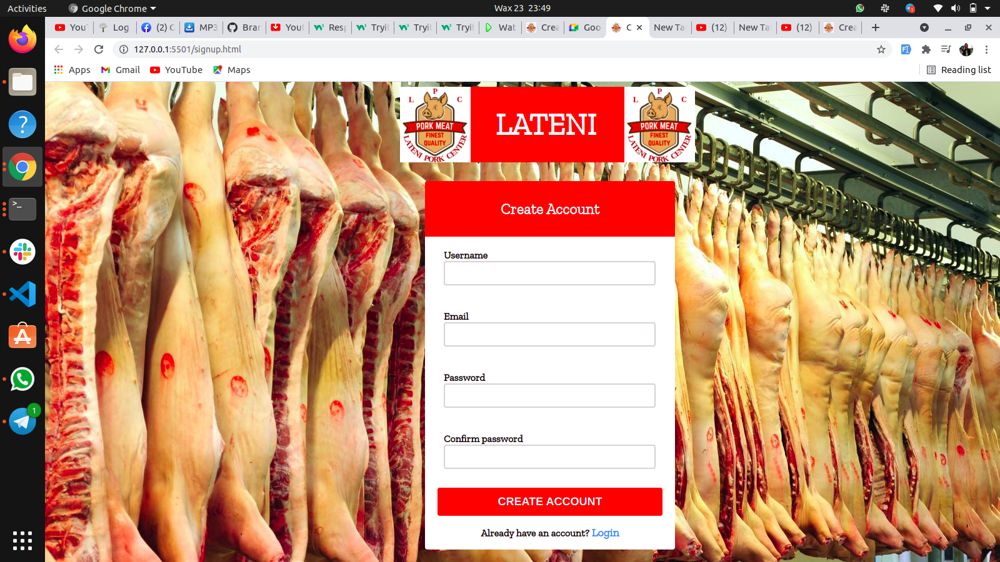
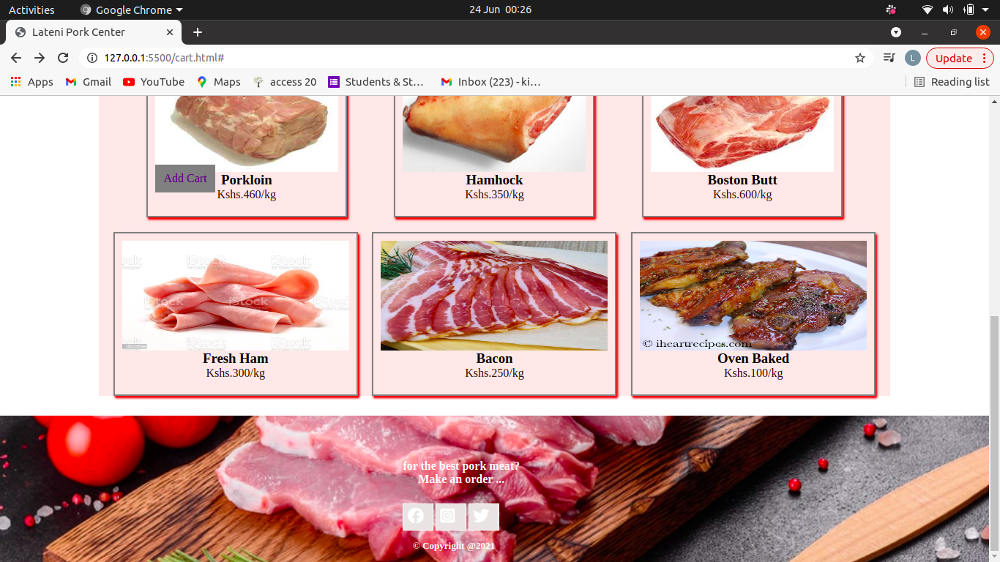
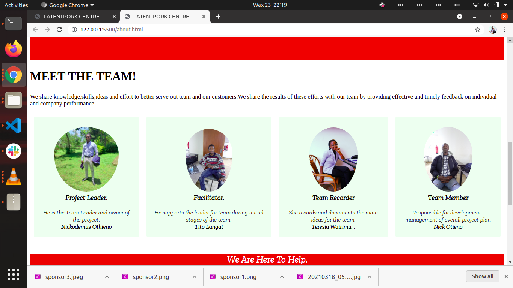
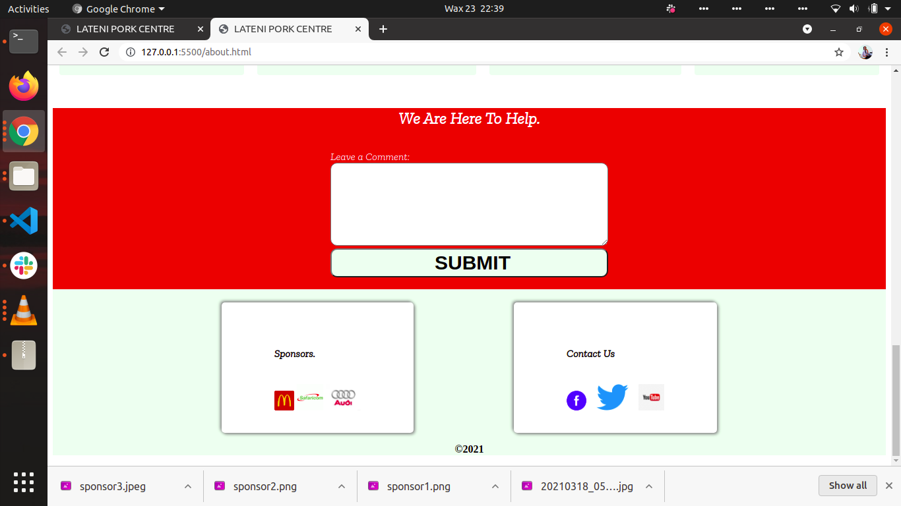

# THE PROJECT NAME IS;
## LATENI PORK CENTRE.
# THE AUTHORS OF THE PROJECT ARE;
* Nickodemus Othieno
* Tito Langat
* Nick Otieno
* Teresia Wairimu

# Project Description
## Lateni Pork Centre was started a month ago after a team of four members identified that there is scarcity of Pork in Nairobi County.The team came together and created a website that links the farmers and consumers hence increasing sales and also making pork available to consumers in Nairobi County.

# What is in the website;
### The website has a logo and a few customer reviews on the home page.The second page has the sign up and log in page for the user and the admin in order to access the page.The third page is the shopping cart where users can place orders on what they need.The last page is the abou us page that briefly describes the website.
## The website has;
* A logo
* Images
* Videos
* Icons
* Links
# Technologies Used;
* HTML
* CSS
* JAVASCRIPT
# Instructions
* The website uses Internet.
* Can be viewed on a laptop,smartphone,tablet and a computer.
* 
# LICENCE
###  
### 
### 
### 
### 
# How to reach us;
nickodemus.otsieno@student.moringaschool.com
nick.odongi@student.moringaschool.com
teresia.wairimu@student.moringaschool.com
langat.kipkirui@student.moringaschool.com
# &copy;2021

